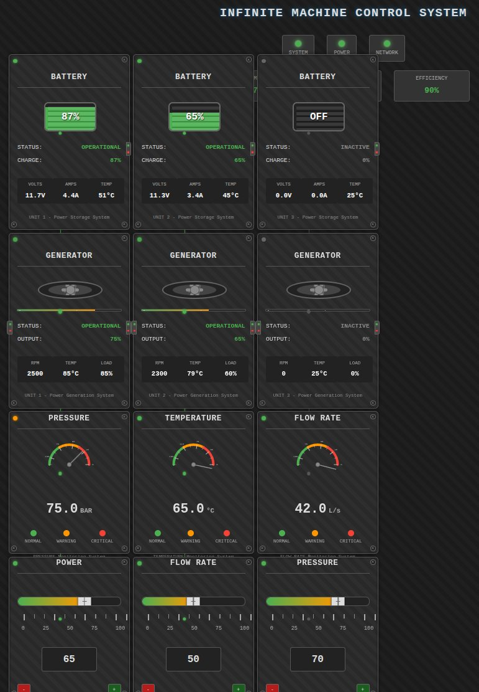

# Infinite Machine Frontend

A modern React-based frontend for the Infinite Machine simulator.



## Overview

This frontend application provides a visual interface for the Infinite Machine simulator. It dynamically renders machine components based on configuration received from the backend.

## Architecture

- The components, layout, and functionality are derived from the backend configuration
- The application communicates with the backend API to receive machine state and send control commands
- Components are rendered based on their type and properties defined in the configuration

## Features

- Dynamic component rendering based on machine configuration
- Real-time visualization of machine states
- Interactive controls for machine components
- LED indicators to activate/deactivate components
- Responsive design for different screen sizes

## Component Interaction

- Each component can be controlled using the LED indicator in its top-right corner
- Clicking on the LED toggles the component's active state
- Some components have additional interactive elements like sliders and gauges
- The application automatically updates the display based on the machine's current state

## Development

This project is built with:
- React
- TypeScript
- Vite
- Tailwind CSS

## Getting Started

```bash
# Install dependencies
npm install

# Start the development server
npm run dev
```

Make sure the backend simulator is running to see the full functionality.
